# Cell Balancing in EV Battery Packs: Simulation and Machine Learning Surrogate

## a. Overview

A battery pack is only as good as its weakest cell. When cells in a series string drift to different charge levels, usable capacity shrinks and some cells get stressed. This project simulates three ways of pulling cells back into line (passive shunt, inductor buck-boost and flying capacitor balancing) on a 4-cell pack of 18650 lithium-ion cells. It compares how fast each one balances and how much energy it wastes. It then trains a machine learning model that predicts those results about 100 times faster than running the simulation.

- **Speed:** from a 10 % charge imbalance, the inductor buck-boost balances in **1.17 h**, the flying capacitor in **2.54 h** and the passive shunt in **4.56 h**.
- **Energy:** passive balancing burns **7680 J** as heat. The buck-boost loses **221 J** (96.4 % efficient) and the flying capacitor only **20.5 J** (99.6 % efficient).
- **Prediction:** the machine learning model, trained on 6000 simulated runs, predicts balancing time with **R² = 0.973** and wasted energy with **R² = 0.995** on unseen packs, about **93x** faster than simulating them: about 38 µs per prediction vs 3.6 ms per simulated pack (the exact factor depends on the machine).

## b. Motivation

An electric vehicle pack contains hundreds or thousands of lithium-ion cells. Many of them are connected in series to reach a high voltage, typically 400 V or 800 V. Every cell must stay inside a safe window of voltage, current and temperature. A **battery management system (BMS)** is the electronics and software that watches every cell and keeps the pack inside that window. It measures voltages, estimates how full each cell is, protects against faults and balances the cells.

No two cells are identical. Small manufacturing differences in capacity, internal resistance and self-discharge rate, plus temperature differences across the pack, make cells drift apart over hundreds of cycles. This drift is **cell imbalance**: cells in the same string end up holding different fractions of their charge.

In a series string, the same current flows through every cell. This has two consequences:

- **Charging must stop when the fullest cell reaches its upper voltage limit,** even though the others are not yet full.
- **Discharging must stop when the emptiest cell reaches its lower voltage limit,** even though the others still hold energy.

The weakest cell therefore sets the usable capacity of the whole pack. A 10 % imbalance can cost roughly 10 % of driving range.

Balancing matters for three reasons:

- **Range:** it restores the capacity that the weakest cell would otherwise lock away.
- **Safety:** it prevents individual cells from being overcharged or overdischarged, which can cause lithium plating, gas generation or thermal runaway.
- **Lifespan:** it stops a few cells from working harder than the rest and ageing faster, which would make the imbalance worse over time.

## c. Glossary

| Term | Definition |
| --- | --- |
| Active balancing | Balancing that moves charge from fuller cells into emptier cells instead of burning it off. It needs more circuitry but wastes little energy. |
| Averaged model | A model that replaces fast switching waveforms with their average value over one switching period. It captures behaviour over minutes and hours without simulating every microsecond pulse. |
| Balancing | Any method that equalises the state of charge of the cells in a series string. |
| Bleed current | The current drawn out of a cell through a shunt resistor during passive balancing. |
| BMS (battery management system) | The electronics and software that monitor, protect and balance a battery pack. |
| Buck-boost converter | A switching power converter that can transfer energy from a source to a load at a higher or lower voltage. Here it stores energy from one cell in an inductor and releases it into the neighbouring cell. |
| C rate | Current expressed relative to cell capacity. 1C on a 3 Ah cell is 3 A, a current that would fully discharge it in one hour. |
| Cell | A single electrochemical unit, here a cylindrical 18650 lithium-ion cell (18 mm diameter, 65 mm long). |
| Cell imbalance | A difference in state of charge between cells in the same series string. |
| Coulomb counting | Estimating state of charge by integrating the current flowing in or out of a cell over time. |
| Drive cycle | A standard speed-versus-time profile, such as WLTP or UDDS, used to test vehicles under repeatable driving conditions. |
| Dataset | A table of examples used to train and test a model. Here each row is one simulated balancing run. |
| Deadband | A small band inside which a controller does nothing, to avoid switching back and forth. Here a converter link turns off when its two cells differ by less than 0.2 % SOC. |
| Decision tree | A model that predicts a value by asking a sequence of yes or no questions about the inputs, such as "is the SOC spread above 6 %?", and returning the average answer stored in the leaf it reaches. |
| Discontinuous conduction mode (DCM) | An operating mode of an inductor converter where the inductor current falls to zero before each new switching cycle starts. |
| Duty cycle | The fraction of each switching period during which a switch is on. This project uses D = 0.4. |
| EMI (electromagnetic interference) | Unwanted electrical noise radiated or conducted by fast-switching circuits. |
| Efficiency | Energy delivered into the receiving cells divided by energy taken from the source cells, as a percentage. |
| Energy dissipation | Energy turned into heat instead of being stored, in joules (J). |
| Equivalent circuit model | A model that represents a battery's electrical behaviour with ideal circuit elements (voltage source, resistors and capacitors) instead of chemistry equations. |
| ESR (equivalent series resistance) | The small unavoidable resistance of a real capacitor. |
| Feature | One input variable given to a machine learning model, such as SOC spread or inductance. |
| Flying capacitor | A capacitor that is switched back and forth between two cells. It charges from the fuller cell and discharges into the emptier one. |
| GRU (gated recurrent unit) | A type of neural network designed for sequences, able to remember past measurements when estimating a present quantity such as SOC. |
| Gradient boosting | A machine learning method that builds many small decision trees one after another, each correcting the errors left by the trees before it. |
| Inductor | A coil that stores energy in its magnetic field. Its current cannot change instantly, which is what lets switching converters move energy. Unit: henry (H). |
| Internal resistance | The resistance inside a cell that causes its terminal voltage to drop under load and turns part of the energy into heat. Unit: ohm (Ω). |
| Learning rate | In gradient boosting, the weight given to each new tree's correction. Small values learn slowly but generalise better. |
| Log transform | Training a model on the logarithm of a target instead of the raw value, so that errors on small and large values carry similar weight. |
| MAE (mean absolute error) | The average size of the prediction error, in the same unit as the target (seconds or joules). |
| MOSFET | A transistor used as a fast electronic switch in power circuits. |
| NMC | Lithium nickel manganese cobalt oxide, a common high-energy cathode chemistry for EV cells, with an operating voltage of about 3.0 V to 4.2 V. |
| OCV (open circuit voltage) | The voltage of a cell at rest with no current flowing. It rises with state of charge and is the main clue a BMS uses to estimate SOC. |
| On resistance | The small resistance of a MOSFET when it is switched on, written R_ds,on. |
| One-hot encoding | Representing a category such as "technique" as several 0 or 1 columns, one per option, with exactly one set to 1. |
| Parasitic resistance | Unwanted resistance in real components, such as inductor winding resistance, MOSFET on resistance and capacitor ESR. It causes conduction losses. |
| Passive balancing | Balancing by burning off excess charge from fuller cells as heat in resistors. |
| PCHIP interpolation | A smooth curve through table points that never overshoots between them, used here to turn the OCV table into a smooth curve. |
| Permutation feature importance | A way to measure how much a model relies on an input. The input's values are shuffled randomly and the drop in accuracy is recorded. |
| PWM (pulse width modulation) | Controlling a switch by varying how long it stays on in each fixed-length period. |
| R² (coefficient of determination) | A score of how much of the variation in the true values a model explains. 1 is perfect, 0 is no better than always guessing the average. |
| Reinforcement learning | A machine learning approach where an agent learns a control policy by trial and error, guided by a reward signal. |
| RMS (root mean square) | The effective value of a varying current. The resistive loss of a waveform equals RMS current squared times resistance. |
| RC pair | A resistor and a capacitor in parallel. In a cell model it represents slow voltage effects that build up and relax over tens of seconds. |
| Seed | A fixed starting number for the random number generator, so that every run produces identical results. |
| Series pack | Cells connected end to end so their voltages add and the same current flows through all of them. |
| Shunt resistor | A resistor switched in parallel with a cell to drain current from it. |
| SOC (state of charge) | How full a cell is, from 0 % (empty) to 100 % (full). |
| SOC spread | The highest cell SOC minus the lowest cell SOC in a pack. This project calls a pack balanced when the spread is below 1 %. |
| SOH (state of health) | A cell's present capacity compared with its capacity when new. It describes ageing. |
| Speedup | Simulation time per pack divided by model prediction time per pack. |
| Surrogate model | A fast approximate model trained to reproduce the outputs of a slower, more detailed model. |
| Switched capacitor | The general family of circuits that move charge by switching capacitors between nodes. A flying capacitor balancer is one example. |
| Switching frequency | How many on and off cycles a converter performs per second. Unit: hertz (Hz). |
| Target | The quantity a model is trained to predict. Here: balancing time and energy dissipated. |
| Thermal runaway | A self-accelerating overheating reaction inside a lithium-ion cell that can lead to fire. |
| Thevenin model | An equivalent circuit made of a voltage source, a series resistor and one or more RC pairs. This project uses one RC pair (a 1RC model). |
| Time constant | The time an RC circuit takes to cover about 63 % of a step change, τ = R·C. Unit: seconds (s). |
| Training and test split | Dividing the dataset so the model learns from one part (80 %) and is scored on a part it has never seen (20 %). |
| Vectorization | Writing code that processes whole arrays at once instead of looping over elements one by one. This project simulates thousands of packs in parallel this way. |

## d. System architecture

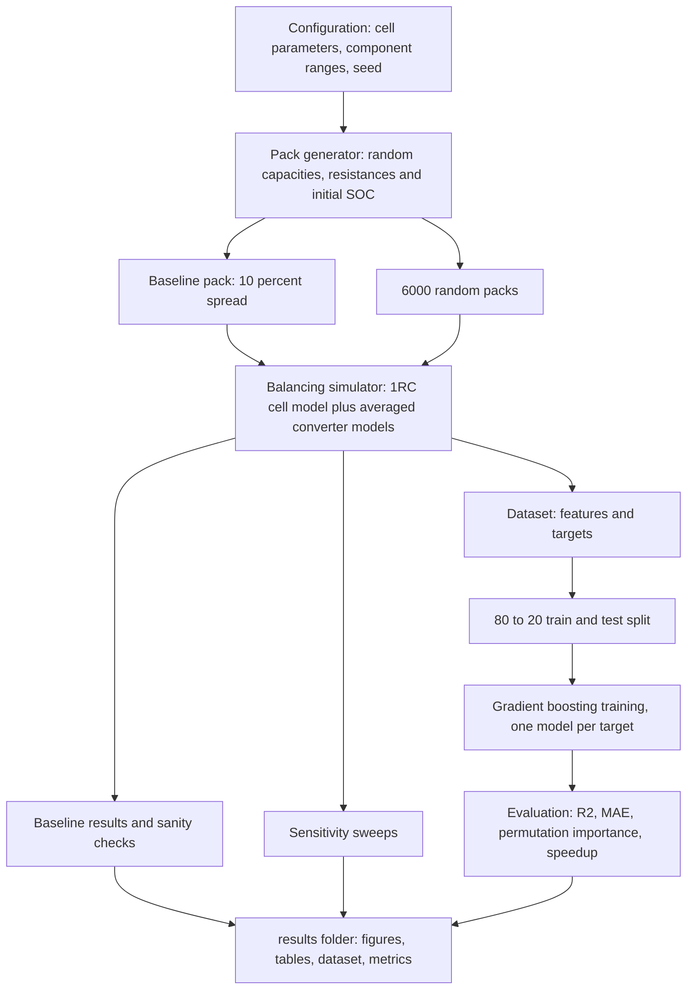

## e. Cell model

Each cell is a 3 Ah NMC 18650, modelled as a first-order Thevenin equivalent circuit. An ideal voltage source gives the open circuit voltage, which depends on state of charge. A series resistor R0 captures the instant voltage drop when current flows. One parallel R1 and C1 pair captures the slower voltage change that builds up over tens of seconds.

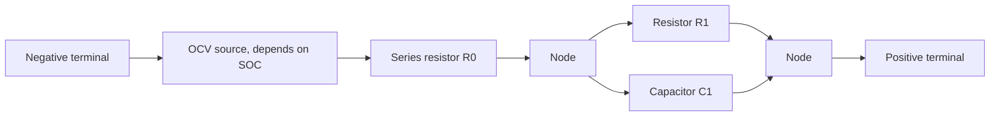

The terminal voltage is the OCV minus the drop across R0 and across the RC pair:

$$
V = \text{OCV}(\text{SOC}) - i \, R_0 - V_1
$$

The voltage across the RC pair relaxes toward i·R1 with time constant τ:

$$
\frac{dV_1}{dt} = -\frac{V_1}{R_1 C_1} + \frac{i}{C_1}, \qquad \tau = R_1 C_1
$$

Over one simulation step Δt the current is held constant, which gives an exact update that stays stable for any step size:

$$
V_1[k+1] = V_1[k] + \left(1 - e^{-\Delta t / \tau}\right)\left(i \, R_1 - V_1[k]\right)
$$

State of charge follows from coulomb counting:

$$
\text{SOC}(t) = \text{SOC}_0 - \frac{1}{3600 \, Q} \int_0^t i \, dt
$$

| Symbol | Meaning | Unit | Value in this project |
| --- | --- | --- | --- |
| $V$ | Terminal voltage | V | |
| $\text{OCV}$ | Open circuit voltage, from a 21-point NMC table (3.00 V at 0 % to 4.20 V at 100 %) with PCHIP smoothing | V | about 3.71 V at 50 % |
| $\text{SOC}$ | State of charge | fraction, 0 to 1 | starts near 0.5 |
| $i$ | Cell current, positive when discharging | A | |
| $R_0$ | Series (ohmic) resistance | Ω | 30 mΩ ± 10 % |
| $R_1$ | Polarisation resistance | Ω | 15 mΩ |
| $C_1$ | Polarisation capacitance | F | 2000 F |
| $V_1$ | Voltage across the RC pair | V | starts at 0 V (cell at rest) |
| $\tau$ | Time constant of the RC pair | s | 30 s |
| $\Delta t$ | Simulation step | s | 1 s |
| $Q$ | Cell capacity | Ah | 3 Ah ± 5 % |
| $3600$ | Seconds per hour, converting Ah to coulombs | s/h | |

The pack is 4 cells in series at rest, with no external load. For each pack, capacities are drawn within ± 5 % and R0 within ± 10 % of nominal. The four initial SOCs are spread around 50 % with a max-minus-min spread between 2 % and 10 %.

## f. Balancing techniques

All three techniques are simulated with averaged models at a fixed 1 s step. A run stops when the SOC spread falls below 1 %, or at a 48 h cap; no run reached the cap. For every technique the same energy bookkeeping is used, counted as chemical energy (OCV times current):

$$
E_\text{removed} = \int \sum_\text{sources} \text{OCV}_s \, I_s \, dt, \qquad
E_\text{delivered} = \int \sum_\text{sinks} \text{OCV}_k \, I_k \, dt
$$

$$
E_\text{dissipated} = E_\text{removed} - E_\text{delivered}, \qquad
\eta = \frac{E_\text{delivered}}{E_\text{removed}}
$$

Here $\text{OCV}_s$, $I_s$ are the open circuit voltage (V) and current (A) of each cell giving up charge. $\text{OCV}_k$, $I_k$ are the same quantities for each cell receiving charge. $E$ is energy in joules and $\eta$ is efficiency (dimensionless). Because the bookkeeping uses chemical energy, the dissipated energy includes both the balancing circuit losses and the cells' own resistive losses.

### Passive shunt balancing

**Principle.** Every cell has a resistor and a MOSFET switch across it. When a cell's SOC is above the pack average, its switch closes and the resistor drains current from it until it drops to the level of the others. The excess charge is simply turned into heat.

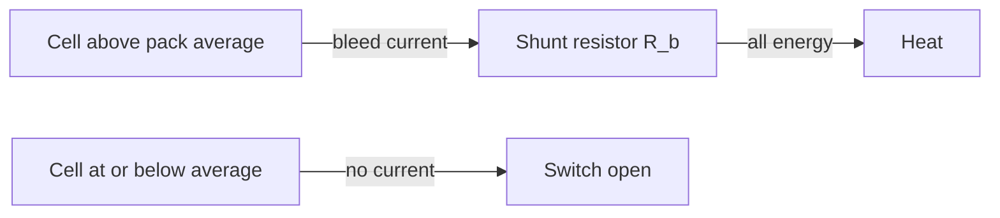

The resistor sees the cell's terminal voltage, so the bleed current and resistor loss are:

$$
I = \frac{V}{R_b} = \frac{\text{OCV} - V_1}{R_b + R_0}, \qquad P_\text{loss} = I^2 R_b
$$

| Symbol | Meaning | Unit |
| --- | --- | --- |
| $I$ | Bleed current | A |
| $V$ | Cell terminal voltage | V |
| $R_b$ | Bleed (shunt) resistance | Ω |
| $\text{OCV}$, $V_1$, $R_0$ | Cell quantities from section e | V, V, Ω |
| $P_\text{loss}$ | Power turned into heat in the resistor | W |

**Advantages:** very simple, cheap and small. Control is a single on or off decision per cell, and it is used in most production BMS designs.

**Drawbacks:**
- All excess energy is wasted as heat, so efficiency is 0 %.
- Balancing is slow, because the bleed current must stay small to limit heat.
- It can only lower the fuller cells, never raise the emptier ones.

**Range used:** R_b from 20 Ω to 100 Ω, which gives bleed currents of about 185 mA down to 37 mA.

### Inductor buck-boost balancing

**Principle.** A small buck-boost converter sits between each pair of neighbouring cells, three converters for four cells. In the first part of each switching cycle a MOSFET connects the fuller cell across an inductor, and current ramps up as energy builds in the inductor's magnetic field. The MOSFET then opens and the inductor current flows into the neighbouring cell, ramping down to zero. Charge reaches distant cells by passing along the chain. A link switches on only when its two cells differ by more than 0.2 % SOC.

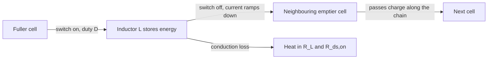

In discontinuous conduction mode the peak and average source currents are:

$$
I_\text{pk} = \frac{V_\text{src} \, D \, T_s}{L}, \qquad
I_\text{avg} = \frac{V_\text{src} \, D^2 \, T_s}{2L} = \frac{D}{2} \, I_\text{pk}, \qquad T_s = \frac{1}{f}
$$

The inductor releases its energy into the sink cell over a second interval, and the conduction loss follows from the RMS value of the two triangular current pulses:

$$
D_2 = D \, \frac{V_\text{src}}{V_\text{sink}}, \qquad
P_\text{cond} = \left(R_L + R_\text{ds,on}\right) I_\text{pk}^2 \, \frac{D + D_2}{3}
$$

$$
P_\text{out} = V_\text{src} \, I_\text{avg} - P_\text{cond}
$$

| Symbol | Meaning | Unit | Value or range |
| --- | --- | --- | --- |
| $V_\text{src}$, $V_\text{sink}$ | Terminal voltage of the giving and receiving cell | V | about 3.7 V |
| $D$ | Duty cycle of the charging switch | dimensionless | 0.4 |
| $D_2$ | Fraction of the period the inductor spends discharging | dimensionless | about 0.4 |
| $T_s$ | Switching period | s | 20 µs to 100 µs |
| $f$ | Switching frequency | Hz | 10 kHz to 50 kHz |
| $L$ | Inductance | H | 10 µH to 100 µH |
| $I_\text{pk}$ | Peak inductor current | A | |
| $I_\text{avg}$ | Average current drawn from the source cell | A | 0.06 A to 3 A |
| $R_L$ | Inductor winding (parasitic) resistance | Ω | 80 mΩ |
| $R_\text{ds,on}$ | MOSFET on resistance | Ω | 20 mΩ |
| $P_\text{cond}$ | Conduction loss | W | |
| $P_\text{out}$ | Power delivered into the sink cell | W | |

**Advantages:**
- Fast, because currents of hundreds of milliamps to amps are possible.
- High efficiency, 96.4 % at mid-range values.
- Transfer does not depend on the voltage difference, so it stays fast right to the end.

**Drawbacks:**
- The most components and the highest cost: inductors, MOSFETs and gate drivers.
- The most complex control: PWM, direction selection and current limits.
- Magnetic components are bulky.
- At small L·f products the peak currents become large and efficiency drops sharply (47 % in the worst dataset case).

**Ranges used:** L from 10 µH to 100 µH, f from 10 kHz to 50 kHz and D fixed at 0.4. The inductor resistance is 80 mΩ and the MOSFET on resistance 20 mΩ.

### Flying capacitor balancing

**Principle.** A capacitor is switched back and forth between two neighbouring cells, three capacitors for four cells. Connected to the fuller cell, it charges to that cell's voltage. Connected to the emptier cell, it discharges into it. Each cycle moves a packet of charge proportional to the voltage difference. As the cells converge, the difference shrinks and so does the current, which is why this technique slows down sharply near the end.

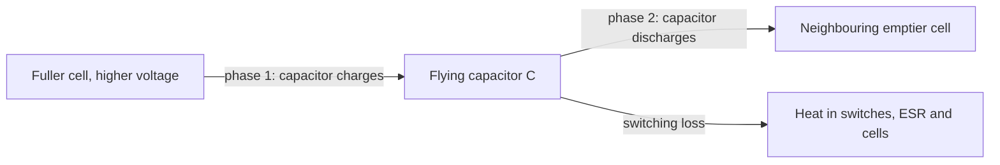

The average current is the charge moved per cycle times the number of cycles per second. The voltage swing on the capacitor is whatever remains of the cells' voltage difference after the drops across the resistances in the loop:

$$
I = f \, C \, \Delta V_c, \qquad \Delta V_c = \Delta E - I \, R_s
\quad \Rightarrow \quad
I = \frac{\Delta E}{\dfrac{1}{f C} + R_s}
$$

$$
R_s = 2 R_\text{ds,on} + R_\text{ESR} + R_{0,a} + R_{0,b}, \qquad \Delta E = (\text{OCV}_a - V_{1,a}) - (\text{OCV}_b - V_{1,b})
$$

Each switching event loses $\tfrac{1}{2} C \Delta V_c^2$ and there are two events per period, so the switching loss is:

$$
P_\text{sw} = 2 \cdot \tfrac{1}{2} C \, \Delta V_c^2 \cdot f = \frac{I^2}{f C}
$$

| Symbol | Meaning | Unit | Value or range |
| --- | --- | --- | --- |
| $I$ | Average transfer current | A | |
| $f$ | Switching frequency | Hz | 1 kHz to 10 kHz |
| $C$ | Flying capacitance | F | 1 mF to 10 mF |
| $\Delta V_c$ | Voltage swing on the capacitor per cycle | V | |
| $\Delta E$ | Difference in internal cell voltage between cells a and b | V | about 60 mV at 10 % SOC difference |
| $R_s$ | Total series resistance in the loop | Ω | about 0.09 Ω |
| $R_\text{ds,on}$ | MOSFET on resistance | Ω | 10 mΩ |
| $R_\text{ESR}$ | Capacitor equivalent series resistance | Ω | 5 mΩ |
| $R_{0,a}$, $R_{0,b}$ | Series resistance of the two cells | Ω | about 30 mΩ each |
| $P_\text{sw}$ | Switching loss | W | |

**Advantages:**
- Highest efficiency (99.6 % at mid-range values), because losses scale with the square of a small voltage difference.
- No magnetics and simple fixed-clock control.
- Self-regulating, because current automatically stops when the cells are equal.

**Drawbacks:**
- Balancing slows sharply as the voltage difference shrinks, especially on the flat middle part of the NMC OCV curve.
- Current is limited when cells have similar voltage but different SOC.
- Large capacitors are needed.

**Ranges used:** C from 1 mF to 10 mF and f from 1 kHz to 10 kHz. The MOSFET on resistance is 10 mΩ and the capacitor ESR 5 mΩ.

## g. Comparison

Baseline results for the same pack, which starts with a 10 % SOC spread, using mid-range component values. Component counts are for a 4-cell pack in the adjacent-cell layouts simulated here. Cost and control complexity are qualitative engineering judgements.

| Property | Passive shunt | Inductor buck-boost | Flying capacitor |
| --- | --- | --- | --- |
| Component values | R_b = 60 Ω | L = 55 µH, f = 30 kHz | C = 5.5 mF, f = 5.5 kHz |
| Balancing time | 4.56 h (16400 s) | **1.17 h** (4203 s) | 2.54 h (9140 s) |
| Energy dissipated | 7680 J | 220.8 J | **20.5 J** |
| Efficiency | 0 % | 96.4 % | **99.6 %** |
| Time for last 2 % vs first 2 % of spread | 1.0x | 2.7x | 8.3x |
| Component count | 4 resistors, 4 MOSFETs | 3 inductors, 6 MOSFETs | 3 capacitors, 8 MOSFETs |
| Cost | Low | High | Medium |
| Control complexity | Low: on or off per cell | High: PWM, direction and current limits per link | Low to medium: fixed complementary clock |

Across all 6000 dataset runs, the median balancing time was 2.09 h for passive, 0.32 h for buck-boost and 1.20 h for flying capacitor. The median dissipated energy was 3762 J, 94.8 J and 6.8 J respectively.

## h. ML predictor

**What it predicts and why.** Given a pack's state and a candidate balancing circuit, the model predicts how long balancing will take and how much energy it will waste. A real BMS could use this to choose, schedule or tune balancing in real time without running a physics simulation. For example, it could decide whether there is enough parking time to finish balancing, or which of several balancing modes costs the least energy.

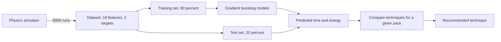

**How the dataset is generated.** For each technique, 2000 random packs are created. Each pack's capacities, resistances and initial SOCs are sampled as described in section e. A component value and switching frequency are drawn uniformly from that technique's range. All 2000 packs are simulated together in one vectorized batch, and each pack drops out of the batch as soon as it balances. This takes about 3.6 ms per pack, while the trained model predicts both targets for a pack in about 38 µs (the best of 20 timed repeats).

**Features (model inputs):**

| Feature | Meaning | Unit |
| --- | --- | --- |
| `soc_spread` | Highest minus lowest initial SOC | fraction |
| `soc_std` | Standard deviation of the four initial SOCs | fraction |
| `soc0_1` to `soc0_4` | Initial SOC of each cell, which tells the model where the high and low cells sit in the string | fraction |
| `capacity_1_ah` to `capacity_4_ah` | Capacity of each cell | Ah |
| `r0_1_ohm` to `r0_4_ohm` | Series resistance of each cell | Ω |
| `is_passive`, `is_buck_boost`, `is_flying_capacitor` | One-hot technique flags | 0 or 1 |
| `component_value` | R_b in Ω, L in H or C in F, depending on technique | SI unit |
| `switching_frequency_hz` | Converter switching frequency, 0 for passive | Hz |

**Targets (model outputs):** `balancing_time_s` (seconds until the SOC spread falls below 1 %) and `energy_dissipated_j` (joules turned into heat).

**How gradient boosting works.** The first small decision tree makes a rough guess. The next tree is trained to predict what the first one got wrong, and its correction is added on with a small weight (the learning rate, 0.05). This repeats 500 times. Each tree is simple, but together they model complex, non-linear relationships. The project uses scikit-learn's `HistGradientBoostingRegressor`, one model per target. Because balancing time and energy span several orders of magnitude (from under 1 J to over 10 kJ), each model learns the logarithm of its target. That way small and large values are fitted with equal care.

**Why R² and MAE.**
- **R²** is scale-free and answers "how much of the variation does the model explain?" This makes it comparable across targets with different units.
- **MAE** is in physical units (seconds or joules) and answers "how far off is a typical prediction?" This is what an engineer needs to judge usefulness.

Reporting both, overall and per technique, shows whether a high overall score hides a weak technique.

| Target | Overall | Passive | Buck-boost | Flying capacitor |
| --- | --- | --- | --- | --- |
| Balancing time R² | 0.973 | 0.994 | 0.959 | 0.888 |
| Balancing time MAE | 415 s | 292 s | 181 s | 771 s |
| Energy dissipated R² | 0.995 | 0.984 | 0.954 | 0.996 |
| Energy dissipated MAE | 72.9 J | 201 J | 17.4 J | 0.1 J |

**How to read the feature importance plot.** Each bar shows how much the test R² drops when that one input is randomly shuffled, which breaks its link to the target. A long bar means the model depends heavily on that input. A bar near zero means the model barely uses it. The black whisker shows the variation over 10 shuffles. Importance reflects what *this model* relies on, not physical causation. When two inputs carry overlapping information, such as SOC spread and SOC standard deviation, the credit is shared between them.

## i. Results

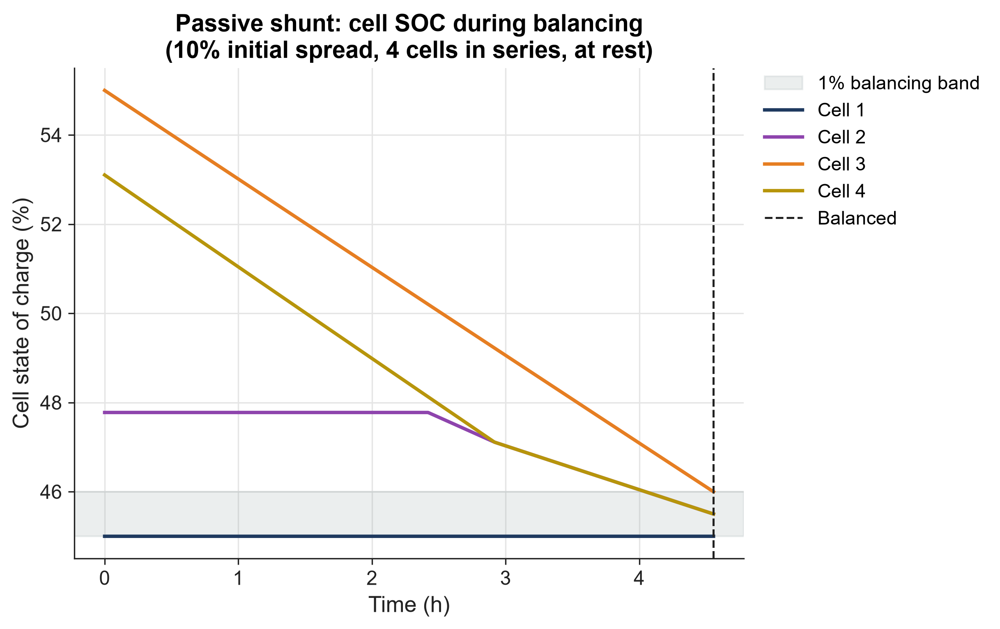

The fuller cells (3 and 4) bleed down at a nearly constant rate while the emptiest cell (1) stays still. Cell 2 joins in once the falling pack average passes it. Passive balancing works by lowering everyone to the weakest cell's level, and it takes 4.56 h to reach the shaded 1 % band.

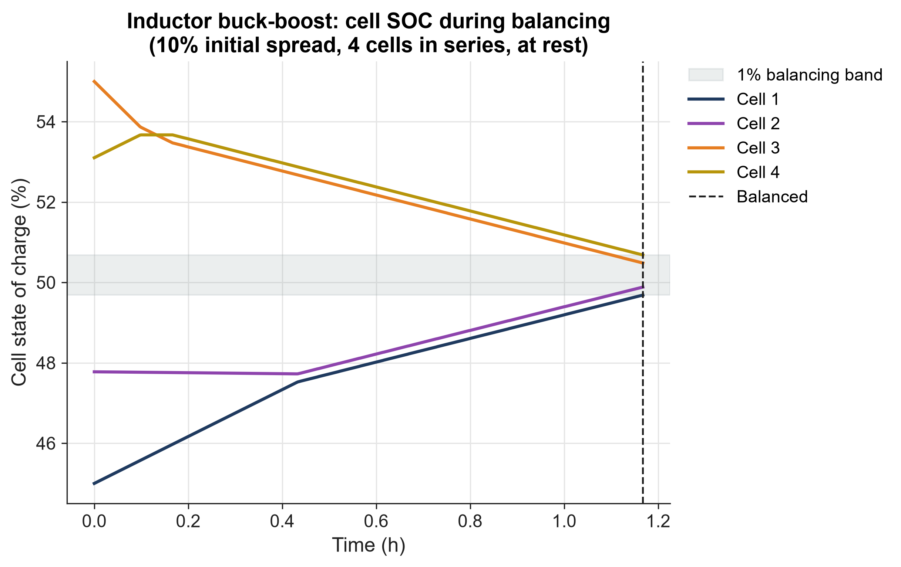

Charge flows from cells 3 and 4 into cells 1 and 2 at a steady rate. The kinks show neighbouring links switching on or off as cells cross each other. All cells meet near the pack average in 1.17 h, the fastest of the three, because the transfer current does not depend on how close the cells already are.

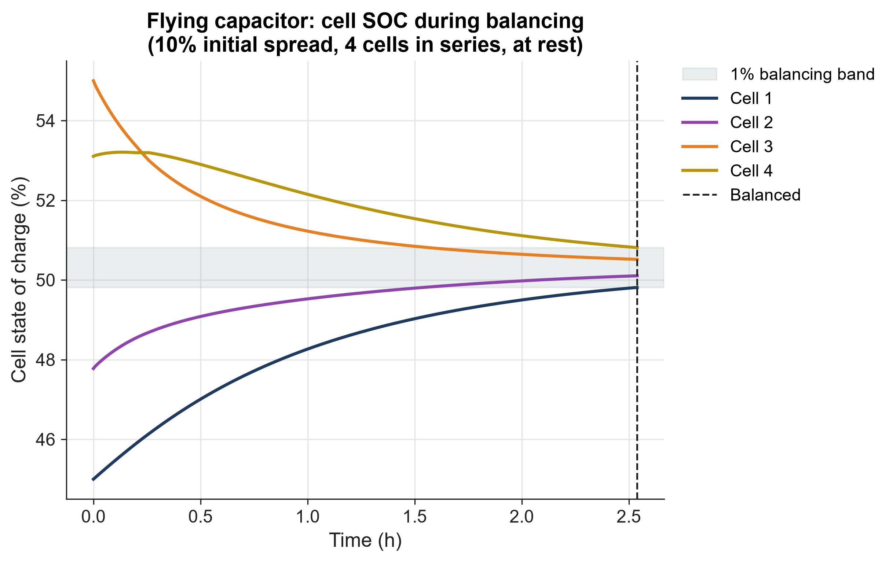

The curves bend like exponential decays. They move fast at first, then flatten as the voltage differences driving the current shrink. The cells converge toward the average without charge being thrown away, balancing in 2.54 h.

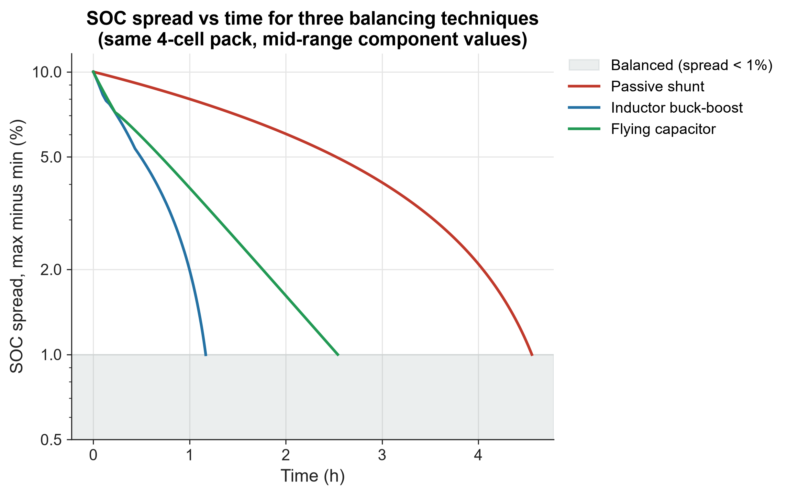

On a logarithmic scale the flying capacitor is a straight line, which confirms exponential decay: its last 2 % of spread takes 8.3 times longer than its first 2 %. Passive and buck-boost curves bend downward instead, because their current stays roughly constant. The buck-boost is fastest overall and passive is slowest.

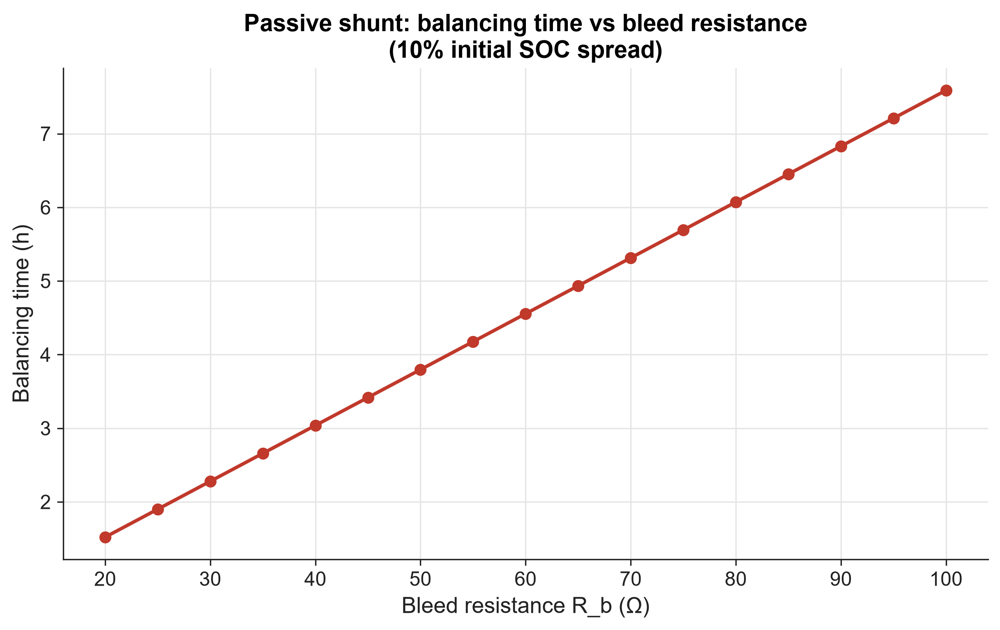

Balancing time rises linearly with bleed resistance, from 1.52 h at 20 Ω to 7.59 h at 100 Ω, because bleed current is inversely proportional to R_b. A smaller resistor balances faster but must dissipate more power as heat at any one moment.

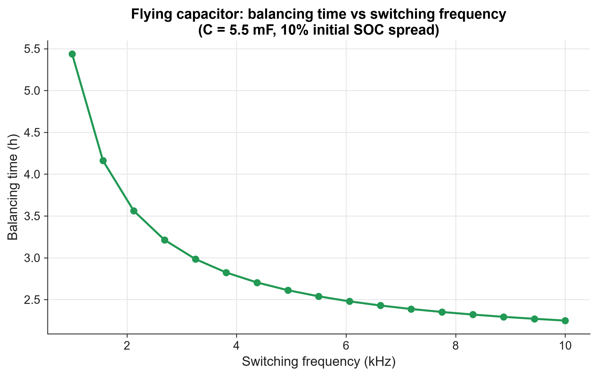

Raising the frequency from 1 kHz to 10 kHz cuts balancing time from 5.44 h to 2.25 h, with diminishing returns. Above a few kHz the switching resistance 1/(f·C) becomes smaller than the fixed resistances of the switches and cells, so further increases barely help.

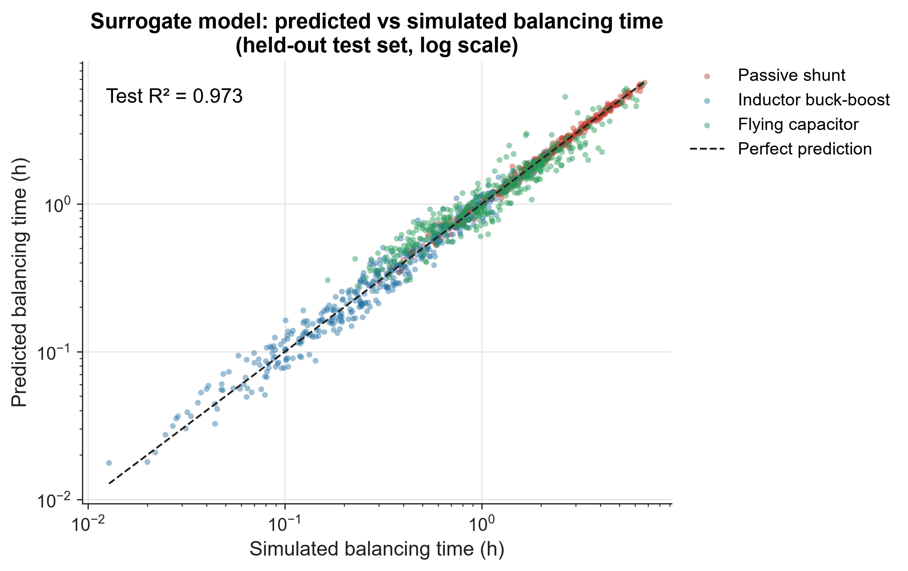

Each point is one test pack the model never saw during training. Points on the dashed line are perfect predictions. Passive and buck-boost points hug the line, while flying capacitor points scatter more, because their exponential tail makes the time sensitive to small differences.

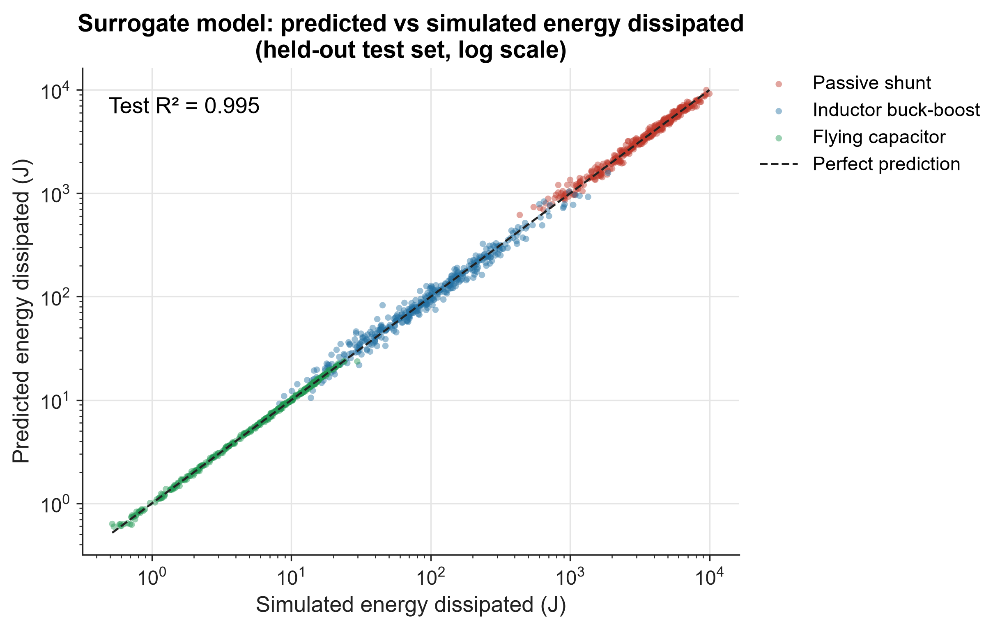

Energy is predicted almost perfectly (R² = 0.995) across four orders of magnitude, from under 1 J to about 10 kJ. The three techniques form separate clusters: flying capacitor at the bottom, buck-boost in the middle and passive at the top.

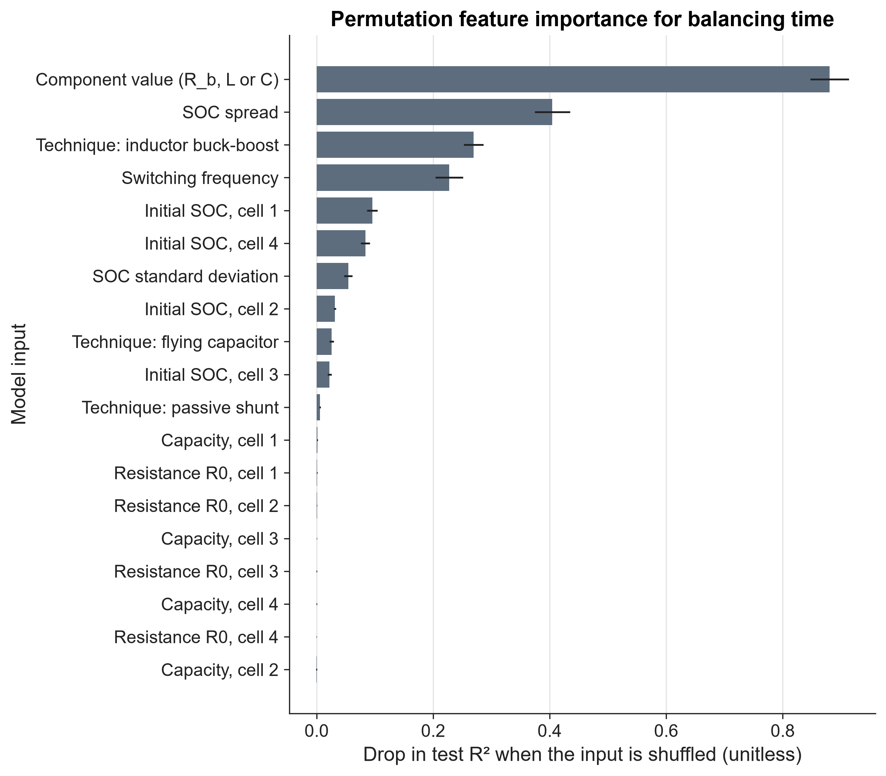

The component value (R_b, L or C) matters most for balancing time, followed by the SOC spread, the technique and the switching frequency. The individual cell SOCs, especially of the end cells 1 and 4, add useful information about how far charge has to travel along the chain. Cell capacities and resistances barely matter within their ± 5 % and ± 10 % tolerances.

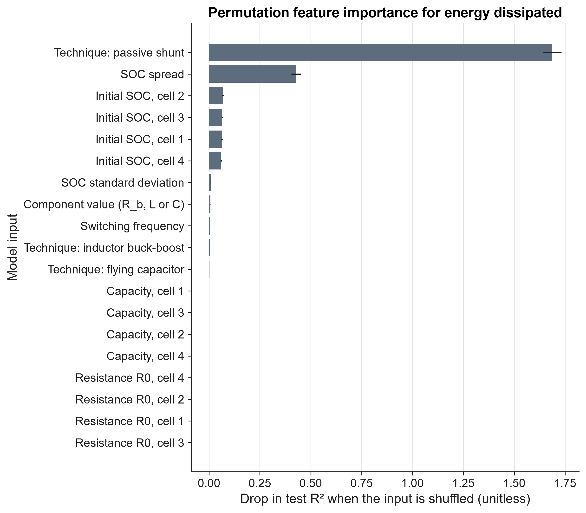

Whether the technique is passive dominates energy, because in the dataset passive wastes a median of about 40 times more than the buck-boost and about 550 times more than the flying capacitor. The SOC spread and the individual cell SOCs come next, since together they set how much charge has to be removed or moved.

## j. Limitations

- **Simulated data only.** The dataset and all results come from models, not from measurements on real cells or real balancing hardware. The ML model is only as accurate as the simulator it imitates.
- **Averaged models.** Converters are represented by their average current and simplified conduction losses, not switching-level waveforms. Gate drive losses, switching transition losses, core losses, dead time and EMI are not modelled.
- **Pack at rest.** Balancing is simulated with no load current. In a vehicle, balancing usually happens while driving or charging, where the load current, voltage sag and SOC estimation error all interact with the balancer.
- **Fixed temperature.** All parameters are for one temperature. In reality internal resistance, capacity and the OCV curve all change with temperature, and balancing losses heat the pack.
- **Other simplifications:**
  - Each cell's SOC is assumed to be known exactly.
  - Cell parameters do not change with SOC or age.
  - Only adjacent-cell topologies are compared.
  - The pack has only four cells.

## k. Future work

- **Balancing under drive cycle load:** run the balancers while the pack follows standard driving profiles such as WLTP or UDDS, to see how load current changes their speed and losses.
- **GRU-based SOC estimator:** replace the ideal SOC with a gated recurrent unit neural network that estimates SOC from measured voltage, current and temperature, and study how estimation error affects balancing decisions.
- **Closed-loop technique selection:** connect the surrogate model to the BMS so that it predicts time and energy for each available balancing mode in real time and picks the best one for the current pack state and available time.
- **Reinforcement learning control:** train an agent to choose which links to activate and at what current, learning a policy that trades balancing speed against energy loss better than fixed rules.

## l. How to run

Requires Python 3.11 or newer. It's best to install into a virtual environment:

```bash
pip install -r requirements.txt
```

```bash
python run_all.py
```

The run reproduces every result from scratch and takes about one minute on a typical laptop CPU. Most of that time is the vectorized simulation of 6000 packs. It prints a short summary and writes everything into `results/`, creating the folder if needed. The seed is fixed, so repeated runs give identical data, tables and figures. Only the measured timing and speedup numbers vary slightly.

| Output file | Content |
| --- | --- |
| `soc_passive.png`, `soc_buck_boost.png`, `soc_flying_capacitor.png` | Baseline per-cell SOC vs time for each technique |
| `soc_spread_comparison.png` / `.svg` | SOC spread vs time for all three techniques |
| `sweep_passive_r_bleed.png` / `.svg` | Passive balancing time vs bleed resistance |
| `sweep_flying_capacitor_frequency.png` / `.svg` | Flying capacitor balancing time vs switching frequency |
| `ml_parity_balancing_time_s.png` / `.svg` | Predicted vs simulated balancing time |
| `ml_parity_energy_dissipated_j.png` / `.svg` | Predicted vs simulated energy dissipated |
| `ml_importance_balancing_time_s.png` | Permutation feature importance for balancing time |
| `ml_importance_energy_dissipated_j.png` | Permutation feature importance for energy dissipated |
| `baseline_table.csv` | Balancing time, energy dissipated and efficiency per technique |
| `dataset.csv` | 6000 simulated runs: features, targets, technique code, efficiency and a balanced flag |
| `metrics.json` | Baseline table, sanity checks, sweep data, ML metrics per technique and speedup |

All PNG figures are 300 dpi, and all figures are saved with empty metadata.

## m. Project structure

```text
.
├── .gitattributes               Line ending normalisation for text files
├── .gitignore                   Excludes Python caches and virtual environments
├── README.md                    This document
├── requirements.txt             Pinned versions of the four libraries used
├── run_all.py                   Runs the full pipeline and writes every output
├── src/
│   ├── __init__.py              Marks src as a Python package
│   ├── config.py                Single source of truth for constants, ranges, seed and plot style
│   ├── cell.py                  1RC Thevenin cell model: OCV curve, RC update, coulomb counting
│   ├── pack.py                  Random 4-cell series pack generation
│   ├── balancing.py             Averaged balancing models and the batched simulator
│   ├── dataset.py               Randomized dataset generation with features and targets
│   ├── predictor.py             Gradient boosting training, metrics, importance and timing
│   └── plots.py                 Shared figure style and every chart
└── results/
    ├── baseline_table.csv       Baseline comparison table
    ├── dataset.csv              Simulated training data
    ├── metrics.json             All numeric results
    ├── soc_*.png                Baseline SOC traces and spread comparison
    ├── sweep_*.png / .svg       Sensitivity sweeps
    └── ml_*.png / .svg          Model parity and feature importance charts
```
